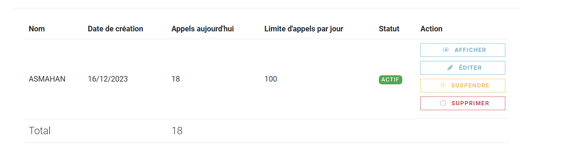
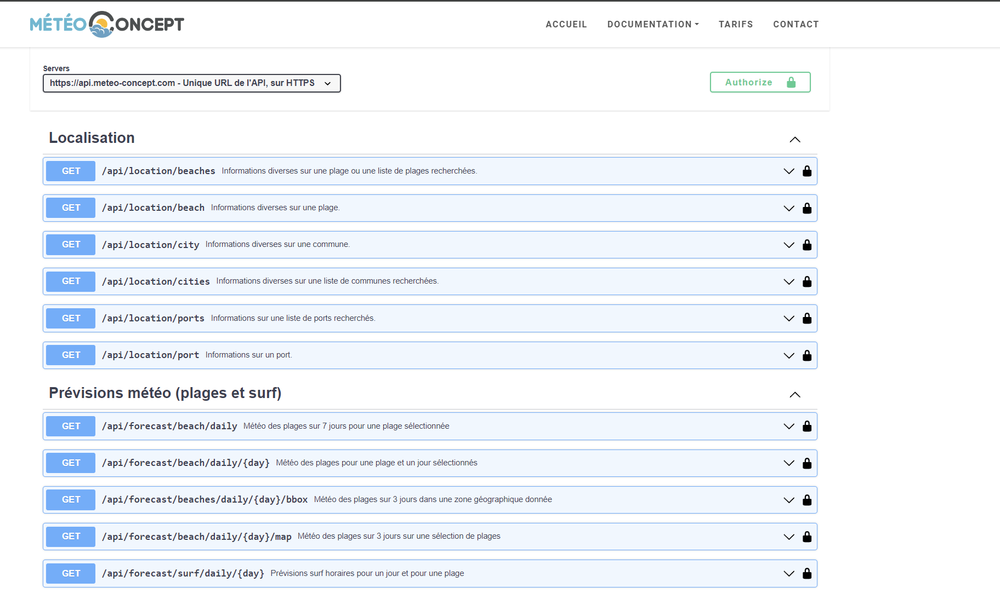

# TP4

TP4 (Lien github : https://github.com/Asmahan355/TP4_API_OUTILLAGE)
## Etape 6

### Faut-il une clé API pour appeler MeteoConcept ?
- **OUI**: L'API MeteoConcept nécessite un token valide pour tester l'API. Ce token peut être transmis soit via l'en-tête HTTP, soit en le passant comme paramètre de requête. Chaque token a une limite maximale de 500 requêtes par jour pour un abonnement gratuit..
  .

### Quelle URL appeler ?
- "https://api.meteo-concept.com/api/forecast/daily/{day}"  en passant longitude, latitude et day comme parametres .

### Quelle méthode HTTP utiliser ?
- **GET**: L'API de Météo Concept n'offre que des requêtes de type GET, comme indiqué dans la documentation OpenAPI (Swagger).


### Comment passer les paramètres d'appels ?
- **https://api.meteo-concept.com/api/forecast/daily/0?latlng=48.086%2C-2.635&insee=35238**: Pour appeler l'API /api/forecast/daily/{day} avec les paramètres requis, nous avons inclus ces paramètres dans la requête GET. Voici comment nous pouvions le faire en fonction des informations fournies :
  Utilisez la latitude (lat) et la longitude (lng) comme paramètres de requête. Et le Passage du token dans l'en-tête HTTP non-standard X-AUTH-TOKEN.
  ``` 
   // Define the API endpoint
        String apiUrl = "https://api.meteo-concept.com/api/forecast/daily/{day}";
        // Set the day parameter value (e.g., 0 for today)
        int day = 0;
        // Set the latitude and longitude for the latlng parameter
        String latlng = lat +","+ lng;

        // Set the authentication token
        String token = apiMeteoToken;

        // Create a map to hold the parameters
        Map<String, String> uriVariables = new HashMap<>();
        uriVariables.put("day", String.valueOf(day));
        uriVariables.put("latlng", latlng);
        uriVariables.put("token", token);

        // Create HttpHeaders and set the accept and X-AUTH-TOKEN headers
        HttpHeaders headers = new HttpHeaders();
        headers.set("accept", "application/json");
        headers.set("X-AUTH-TOKEN", token);

        // Create a RestTemplate
        RestTemplate restTemplate = new RestTemplate();

        // Make the API call
        ResponseEntity<String> responseEntity = restTemplate.exchange(
                apiUrl,
                HttpMethod.GET,
                new org.springframework.http.HttpEntity<>(headers),
                String.class,
                uriVariables
        );
  ```.

### Où est l'information dont j'ai besoin dans la réponse :
- **Pour afficher la température du lieu visé par les coordonnées GPS**: "weather": 3, "tmin": -1,"tmax": 8 
  ```
  weather   : Temps sensible (Code temps) 
  tmin	  : Température minimale à 2 mètres en °C
  tmax	  : Température maximale à 2 mètres en °C   
  ```
- **Pour afficher la prévision de météo du lieu visé par les coordonnées GPS**: object Forecast
  ``` 
  "forecast": {
      "insee": "22288",
      "cp": 22210,
      "latitude": 48.0853,
      "longitude": -2.6433,
      "day": 0,
      "datetime": "2023-12-17T01:00:00+0100",
      "wind10m": 10,
      "gust10m": 26,
      "dirwind10m": 143,
      "rr10": 0,
      "rr1": 0,
      "probarain": 10,
      "weather": 3,
      "tmin": -1,
      "tmax": 8,
      "sun_hours": 5,
      "etp": 0,
      "probafrost": 20,
      "probafog": 60,
      "probawind70": 0,
      "probawind100": 0,
      "gustx": 26
    }
  ```
 
